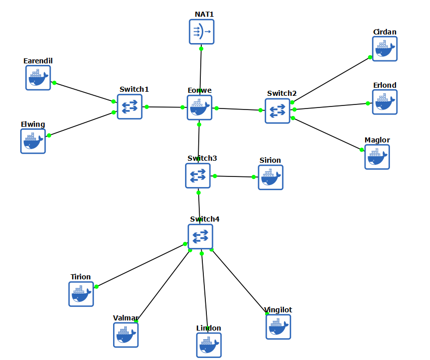
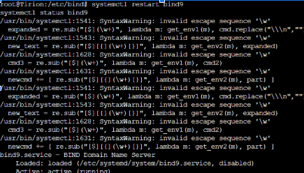
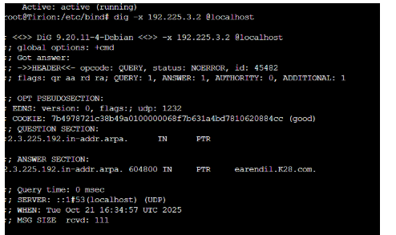
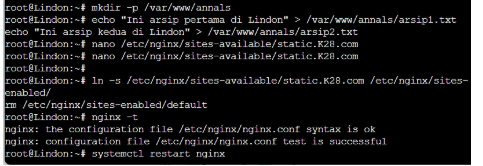
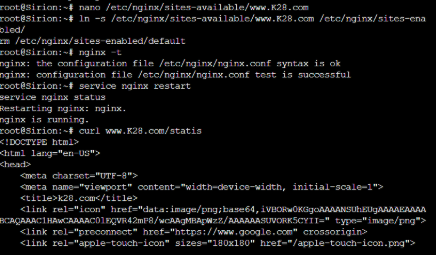
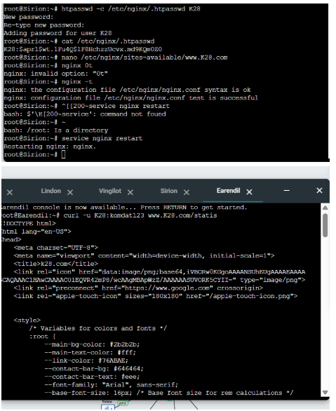

# Jarkom-Modul-2-2025-K-28

## Member

| No  | Nama                   | NRP        |
| --- | ---------------------- | ---------- |
| 1   | Aslam Ahmad Usman      | 5027241074 |
| 2   | Zahra Hafizhah         | 5027241121 |

## Reporting

### Soal 1

Untuk nomor 1 membuat topologi 


###Soal 9

Konfigurasi
File /etc/bind/zones/db.192.225.3
```
2   IN  PTR  sirion.K28.com.
4   IN  PTR  lindon.K28.com.
5   IN  PTR  vingilot.K28.com.
```
Testing
```
dig -x 192.225.3.4
```



### Soal 9

Konfigurasi  : 
File: /etc/nginx/sites-available/static.K28.com    
```
server {
    listen 80;
    server_name static.K28.com;

    root /var/www/annals;
    index index.html;
    autoindex on;
}

```
Testing
```
curl static.K28.com
```


### Soal 11

Konfigurasi
File: /etc/nginx/sites-available/app.K28.com
```
server {
    listen 80;
    server_name app.K28.com;

    root /var/www/elrond;
    index index.php index.html;

    location ~ \.php$ {
        include snippets/fastcgi-php.conf;
        fastcgi_pass unix:/run/php/php7.4-fpm.sock;
    }
}
```
Testing
```
curl app.K28.com
```


### Soal 12

Konfigurasi
File: /etc/nginx/sites-available/www.K28.com
```
server {
    listen 80;
    server_name www.K28.com;

    location /statis {
        proxy_pass http://192.225.3.4;
        proxy_set_header Host $host;
    }

    location /dinamis {
        proxy_pass http://192.225.3.5;
        proxy_set_header Host $host;
    }
}

```
Testing
```
curl www.K28.com/statis
curl www.K28.com/dinamis
```


### Soal 13

Konfigurasi
Tambahkan autentikasi di setiap location:
```
location /statis {
    proxy_pass http://192.225.3.4;
    proxy_set_header Host $host;

    auth_basic "Restricted Access";
    auth_basic_user_file /etc/nginx/.htpasswd;
}

location /dinamis {
    proxy_pass http://192.225.3.5;
    proxy_set_header Host $host;

    auth_basic "Restricted Access";
    auth_basic_user_file /etc/nginx/.htpasswd;
}

```
Buat File password
```
htpasswd -c /etc/nginx/.htpasswd K28
```
Testing
```
curl www.K28.com/statis
```



