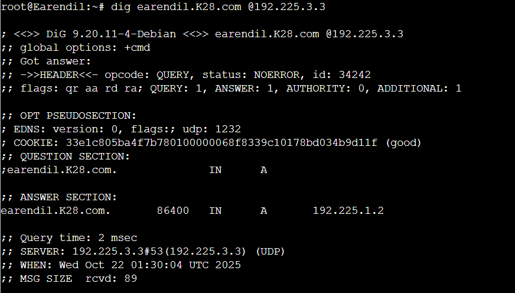
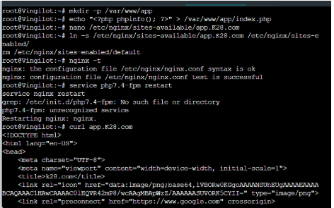

# Jarkom-Modul-2-2025-K-28

## Member

| No  | Nama                   | NRP        |
| --- | ---------------------- | ---------- |
| 1   | Aslam Ahmad Usman      | 5027241074 |
| 2   | Zahra Hafizhah         | 5027241121 |

## Reporting

### Soal 1

Untuk nomor 1 membuat topologi 


### Soal 2


Untuk nomor 2 kita memastikan bahwa host di dalam jaringan dapat mengakses layanan eksternal menggunakan IP address. Kita bisa mengeceknya dengan menjalankan:

```
ping 8.8.8.8
```

Lalu mengkonfigurasi NAT:

```
echo 1 > /proc/sys/net/ipv4/ip_forward
echo "et.ipv4.ip_forward=1" > /etc/sysctl.conf
sysctl -p
iptables -t nat -A POSTROUTING -o eth0 -j MASQUERADE n
```

Setelah itu kita bisa lakukan uji traffic dari host internal, berikut contohnya pada Maglor:


Hasil tersebut menunjukkan NAT berhasil meneruskan trafik.


### Soal 3

Untuk soal ini memastikan bahwa semua klien dapat saling berkomunikasi lintas jalur melalui routing internal via Eonwe. Berikut hasil tes ping dari Cirdan dengan IP Elwing


Respon ping menunjukkan bahwa routing internal berfungsi dengan seharusnya. Lalu menambahkan `echo "nameserver 192.168.122.1" >> /etc/resolv.conf` kedalam konfigurasi masing-masing node. Untuk mengecek apakah berhasil bisa melakukan uji akses internet ke google.


###Soal 4

Di soal ini kita membangun zona di Tirion dan Vermal. Langsung saja, pertama kita melakukan konfigurasi zona di Tirion sebagai ns1 di `/etc/bind/zones/db.K28.com`:

```
$TTL 86400
@ IN SOA ns1.K28.com. admin.K28.com. ( 2025102101 3600 1800 604800 86400 )
@ IN NS ns1.K28.com.
@ IN NS ns2.K28.com.
ns1.K28.com. IN A 192.225.3.3
ns2.K28.com. IN A 192.225.3.4
@ IN A 192.225.3.2
```

Lalu di `/etc/bind/named.conf.local` kita juga menambah:

```
zone "K28.com" {
    type master;
    file "/etc/bind/zones/db.K28.com";
    allow-transfer { 192.225.3.4; };
    also-notify { 192.225.3.4; };
};
```

Kita juga set forwarders di `/etc/bind/named.conf.options`:

```
options {
    forwarders { 192.168.122.1; };
};
```

Setelah itu kita bisa mulai bind dengan `/usr/sbin/named -u bind`. Jika sudah selanjutnya melakukan konfigurasi zona di Valmar sebagai ns2. Pada `/etc/bind/named.conf.local`:

```
zone "K28.com" {
    type slave;
    file "/var/cache/bind/db.K28.com";
    masters { 192.225.3.3; };
};
```

Selanjutnya kita bisa menjalankan rigger transfer dengan `rndc notify K28.com` di Tirion, lalu `killall named && /usr/sbin/named -u bind` di Valmar.

Lalu mengubah setiap resolver di host non-router:

```
echo "nameserver 192.225.3.3
nameserver 192.225.3.4
nameserver 192.168.122.1" > /etc/resolv.conf
```

Lalu kita bisa tes dengan menjalankan dig @192.225.3.3 K28.com pada Tirion, dig @192.225.3.3 K28.com pada Valmar, atau pada non-host lainnya. Berikut hasil dig yang diuji pada earendil:


### Soal 5

Di soal ini kita Menamai hostname semua tokoh sesuai glosarium pada soal dan menguji keberhasilannya;

Pertama-tama kita bisa set Hostname System-Wide di set node, misal pada Earendil:

```
hostnamectl set-hostname earendil || echo "earendil" > /etc/hostname
nano  /etc/hosts
127.0.0.1 localhost
127.0.1.1 earendil
EOF
hostname earendil
```

Kita lakukan hal serupa pada semua node lain kecuali pada ns1 dan ns2 yang sudah dikonfigurasi. Jika sudah maka bisa me-reboot node (bisa dengan menjalankan reload). Lalu kita buat domain dan meng-assign A record di `/etc/bind/zones/db.K28.com` Tirion seperti ini:

```
eonwe   IN A 192.225.1.1
earendil IN A 192.225.1.2
elwing  IN A 192.225.1.3
cirdan  IN A 192.225.2.2
elrond  IN A 192.225.2.3
maglor  IN A 192.225.2.4
sirion  IN A 192.225.3.2
lindon  IN A 192.225.3.5
vingilot IN A 192.225.3.6
```

Jika sudah bisa reload bind dengan /usr/sbin/named -u bind, dan terakhir melakukan tes pada IP, misalnya dengan dig earendil.K28.com @192.225.3.3 di Earendil




### Soal 6 

Disini ada 3 objektif: Memastikan zone transfer berjalan dari Tirion (ns1/master) ke Valmar (ns2/slave), memverifikasi bahwa Valmar telah menerima salinan zona terbaru, dan memastikan nilai serial SOA di kedua server DNS sama.

Pertama kita trigger zone di tirion:

```
rndc notify K28.com
```

Disini status harus "zone notify queued". Lalu zona disinkronkan pada Valmar dengan `killall named && /usr/sbin/named -u bind` Terakhir kita bisa verifikasi dengan DNS query dan membandingkan 2 serial. Berikut hasil perbandingan yang diuji pada Tirion dan Valmar:
 


### Soal 7 

Tujuan utama soal ini: Menambahkan A record untuk sirion.K28.com, lindon.K28.com, dan vingilot.K28.com dengan IP masing-masing, lalu menetapkan CNAME untuk www.K28.com, static.K28.com, dan app.K28.com, serta memverifikasi dari dua klien berbeda


Pertama edit /etc/bind/zones/db.K28.com dan tambah:

```
www      IN CNAME sirion.K28.com.
static   IN CNAME lindon.K28.com.
app      IN CNAME vingilot.K28.com.
```

Setelah kita reload, trigger, dan sinkronisasi ke Valmar, lakukan verifikasi pada 2 klien berbeda. Berikut hasil uji pada Earendil:


Lalu berikut hasil uji pada Elwing:


Hasil verifikasi dari 2 klien diatas menunjukkan hostname ter-resolve dengan benar, karena konsisten untuk semua hostname.


### Soal 8
Pertama bisa menambah deklarasi reverse zone di `/etc/bind/named.conf.local` Tirion

```
zone "3.225.192.in-addr.arpa" {
    type master;
    file "/etc/bind/zones/db.192.225.3";
    allow-transfer { 192.225.3.4; };
    also-notify { 192.225.3.4; };
};
```

Lalu buat file /etc/bind/zones/db.192.225.3 yang berisi:

```
$TTL 86400
@ IN SOA ns1.K28.com. admin.K28.com. ( 2025102201 3600 1800 604800 86400 )
@ IN NS ns1.K28.com.
@ IN NS ns2.K28.com.
2 IN PTR sirion.K28.com.
5 IN PTR lindon.K28.com.
6 IN PTR vingilot.K28.com.
```

Buat folder `mkdir -p /etc/bind/zones && chmod 755 /etc/bind/zones` dan reload dengan `/usr/sbin/named -u bind`

Lalu tambah di /etc/bind/named.conf.local Valmar:

```
zone "3.225.192.in-addr.arpa" {
    type slave;
    file "/var/cache/bind/db.192.225.3";
    masters { 192.225.3.3; };
};
```

Terakhir kita bisa lakukan verifikasi query reverse pada Tirion, Valmar:


### Soal 9

Konfigurasi
File /etc/bind/zones/db.192.225.3
```
2   IN  PTR  sirion.K28.com.
4   IN  PTR  lindon.K28.com.
5   IN  PTR  vingilot.K28.com.
```
Testing
```
dig -x 192.225.3.4
```


### Soal 10

Konfigurasi  : 
File: /etc/nginx/sites-available/static.K28.com    
```
server {
    listen 80;
    server_name static.K28.com;

    root /var/www/annals;
    index index.html;
    autoindex on;
}

```
Testing
```
curl static.K28.com
```


### Soal 11

Konfigurasi
File: /etc/nginx/sites-available/app.K28.com
```
server {
    listen 80;
    server_name app.K28.com;

    root /var/www/elrond;
    index index.php index.html;

    location ~ \.php$ {
        include snippets/fastcgi-php.conf;
        fastcgi_pass unix:/run/php/php7.4-fpm.sock;
    }
}
```
Testing
```
curl app.K28.com
```


### Soal 12

Konfigurasi
File: /etc/nginx/sites-available/www.K28.com
```
server {
    listen 80;
    server_name www.K28.com;

    location /statis {
        proxy_pass http://192.225.3.4;
        proxy_set_header Host $host;
    }

    location /dinamis {
        proxy_pass http://192.225.3.5;
        proxy_set_header Host $host;
    }
}

```
Testing
```
curl www.K28.com/statis
curl www.K28.com/dinamis
```


### Soal 13

Konfigurasi
Tambahkan autentikasi di setiap location:
```
location /statis {
    proxy_pass http://192.225.3.4;
    proxy_set_header Host $host;

    auth_basic "Restricted Access";
    auth_basic_user_file /etc/nginx/.htpasswd;
}

location /dinamis {
    proxy_pass http://192.225.3.5;
    proxy_set_header Host $host;

    auth_basic "Restricted Access";
    auth_basic_user_file /etc/nginx/.htpasswd;
}

```
Buat File password
```
htpasswd -c /etc/nginx/.htpasswd K28
```
Testing
```
curl www.K28.com/statis
```


